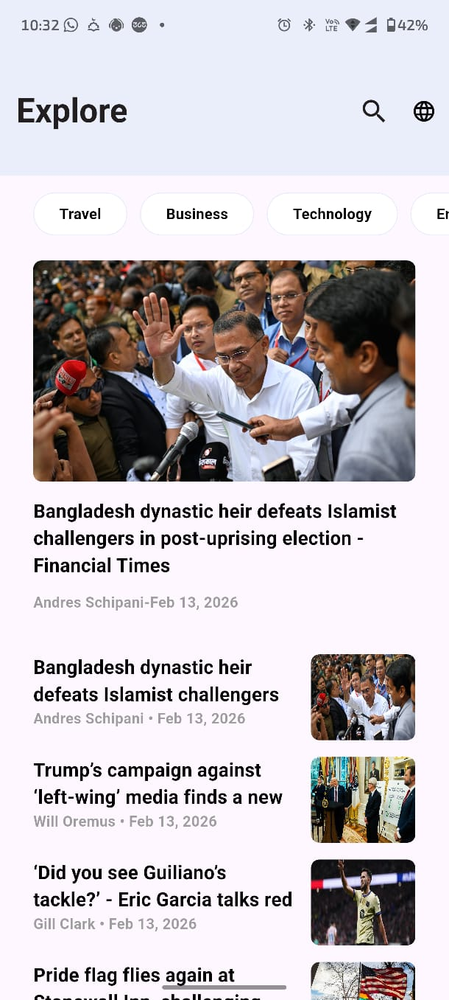

# 📰 News App


> **Stay Informed, Stay Ahead.**
> A modern, fast, and intuitive news application designed to deliver the latest headlines from around the globe directly to your fingertips.

---

## 📱 Project Overview

**News App** is a fully functional mobile application built with **Flutter**, demonstrating high-performance UI rendering and clean code architecture.

This project was developed with a strong focus on **UI/UX design**, ensuring a seamless reading experience. It aggregates real-time data to provide users with up-to-the-minute news across various categories such as Business, Technology, Sports, and Entertainment.

## ✨ Key Features

* **🔥 Breaking News:** Real-time updates from top global sources.
* **📂 Categories:** Filter news by interest (Sports, Tech, Health, Science, etc.).
* **🔍 Smart Search:** Instantly find articles about specific topics.
* **🎨 Modern UI/UX:** A clean, minimalist interface designed for readability.
* **🌙 Dark Mode:** (Optional: Remove if not applicable) Eye-friendly dark theme support.
* **📱 Responsive Design:** Optimized for various Android screen sizes.

---

## 📸 Screenshots


| Home Screen | Article Details |
|:---:|:---:|:---:|
|  |  |


---

## 🛠️ Tech Stack

* **Framework:** Flutter
* **Language:** Dart
* **Architecture:** MVC / MVVM (Select one)
* **State Management:** Provider / Bloc / GetX (Select one)
* **API:** NewsAPI (or whichever source you used)
* **Design:** Custom UI implementation with Flutter Material Design.

---

## 🚀 Getting Started

Follow these steps to run the project locally.

### Prerequisites
* Flutter SDK installed ([Guide](https://docs.flutter.dev/get-started/install))
* Android Studio or VS Code configured.

### Installation

1.  **Clone the repository:**
    ```bash
    git clone [https://github.com/hossamkhalf2003-commits/news_app.git](https://github.com/hossamkhalf2003-commits/news_app.git)
    ```

2.  **Navigate to the project directory:**
    ```bash
    cd news_app
    ```

3.  **Install dependencies:**
    ```bash
    flutter pub get
    ```

4.  **Run the app:**
    ```bash
    flutter run
    ```

---

## 🤝 Contributing

Contributions are what make the open-source community such an amazing place to learn, inspire, and create. Any contributions you make are **greatly appreciated**.

1.  Fork the Project
2.  Create your Feature Branch (`git checkout -b feature/AmazingFeature`)
3.  Commit your Changes (`git commit -m 'Add some AmazingFeature'`)
4.  Push to the Branch (`git push origin feature/AmazingFeature`)
5.  Open a Pull Request

---

## 👤 Author

**Hossam Eldin**
* **Role:** Front-end Developer & UI/UX Designer
* **GitHub:** [hossamkhalf2003-commits](https://github.com/hossamkhalf2003-commits)

---

<p align="center">
  Show some ❤️ and star the repo to support the project!
</p>
